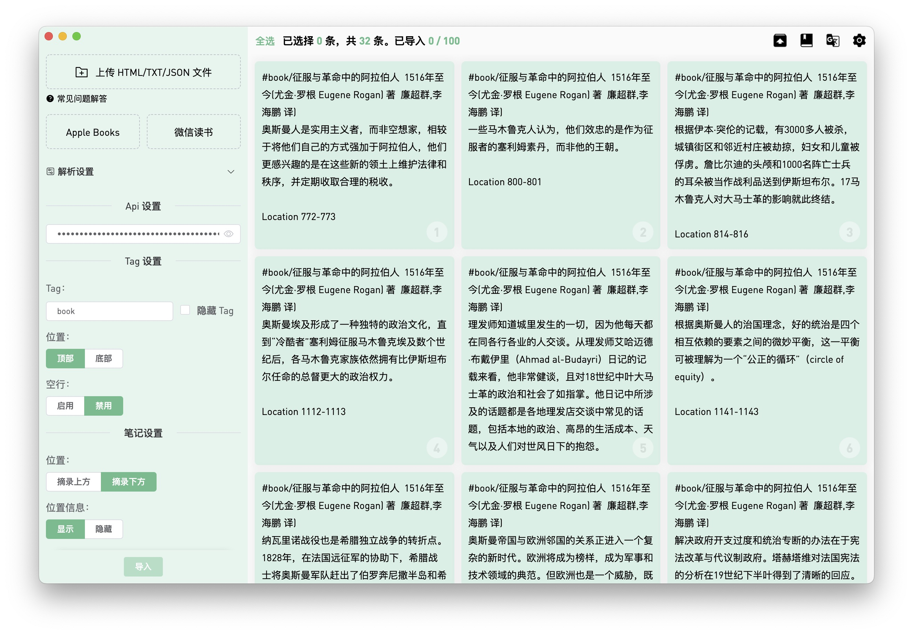

# Send2flomo
> based [Tit1e/SendToflomo](https://github.com/Tit1e/SendToflomo)

### 将 Kindle、Apple Books、KOReader、微信阅读笔记一键导入至 flomo

[中文](./README.md) | [English](./README_en_US.md)

## 功能特点

- **多平台支持**：兼容 Kindle、Apple Books、KOReader、微信读书等多个阅读平台的笔记格式
- **批量导入**：一次性将大量笔记快速导入到 flomo
- **自定义标签**：支持为导入的笔记添加自定义标签，方便分类管理
- **内容编辑**：在导入前可对笔记内容进行编辑调整
- **本地存储**：所有数据本地保存，保障隐私安全
- **多种导出**：支持导出为 Markdown、CSV 等多种格式

## 使用方法

1. 下载并安装 Send2flomo
2. 从您的阅读设备或应用导出笔记（HTML、TXT 或 JSON 格式）
3. 在 Send2flomo 中上传笔记文件
4. 设置 flomo API 并选择要导入的笔记
5. 点击导入按钮，完成笔记迁移

## 预览




## 注册

### [flomo](https://flomoapp.com/register2/)

## 下载

### [Github Releases](https://github.com/Unitary-orz/kindle2Flomo/releases)

## 打包步骤

### 环境准备
1. 确保已安装 Node.js 和 yarn/npm
2. 克隆仓库并进入项目目录
   ```bash
   cd kindle2Flomo
   ```
3. 安装依赖
   ```bash
   yarn install
   ```

### 打包应用
#### Mac系统
```bash
yarn electron:build
```
打包完成后，可在 `dist_electron` 目录下找到以下文件：
- `Send2flomo-x.x.x.dmg`：安装包，双击打开后拖动到应用程序文件夹即可
- `Send2flomo-x.x.x-mac.zip`：压缩包，解压后可直接运行

#### Windows系统
```bash
yarn electron:build
```
打包完成后，可在 `dist_electron` 目录下找到安装包 `Send2flomo Setup x.x.x.exe`

## 开发注意事项
**bplistParser** 这个依赖需手动修改 `maxObjectSize` 与 `maxObjectCount` 这两个常量的数值，修改得大一些，否则当 `Books.plist` 中图书数量过多时会出现无法解析的问题。
```js
exports.maxObjectSize = 1000 * 1000 * 1000;
exports.maxObjectCount = 32768 * 2;
```
